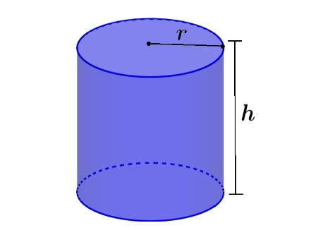

# Exercícios - Tratamento de exceções
[<-- Voltar](./README.md)

### 1. Número ao quadrado

Escreva um programa que leia a entrada do usuário como ```String``` e a converta para ```double```. Caso seja possível converter a entrada, printe o número convertido ao quadrado no terminal, senão printe ```Entrada não numérica```.

Resolva essa questão sem utilizar estrutura condicional ```if```.

### 2. Área das latas

Uma empresa de alimentos em conserva está projetando latas para seu novo produto, você foi incubido de fazer uma função para calcular a área de flande metálico necessária para produzir uma lata cilíndrica.



A equação para calcular a área da lata em função do raio da base ```r``` e da altura ```h``` é dada a seguir:

$$A(r, h) = 2 \pi r \cdot \left( r +  h \right)$$

Escreva uma função que receba dois parâmetros (```r``` e ```h```) do tipo double e retorne o cáculo da área. Essa função só deve aceitar valores positivos, caso contrário, deve lançar uma exceção do tipo ```IllegalArgumentException``` com a mensagem de erro ```Os valores de raio da base e altura da lata devem ser positivos```.

Por fim, leia os valores de ```r``` e ```h``` como entrada do usuário e printe a área calculada pela função no console, caso seja lançada uma exceção printe a sua mensagem de erro no terminal.
