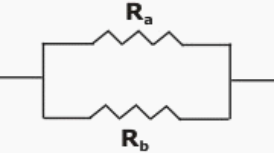

# Exercícios - Operadores
[<-- Voltar](./README.md)

### 1. Resistências em paralelo

Em circuitos eletrônicos podemos associar o valor de duas resistências em paralelo (quando os dois condutores de ambos os resistores estão conectados).



Podemos calcular o valor da resistência equivalente à associação em paralelo de dois resistores Ra e Rb pela equação:

$$R_{eq} = \left( \frac{1}{R_a} + \frac{1}{R_b} \right)^{-1}$$

Também podemos resumir o cálculo a:

$$R_{eq} = \frac{R_a \cdot R_b}{R_a + R_b}$$

Escreva um programa que, armazene o valor das resistências em duas variáveis do tipo double ```a``` e ```b```, sem seguida, calcule o valor da resistência em paralelo, armazene em uma terceira variável (também do tipo double) ```req``` e printe o resultado no console.

### 2. IMC

Escreva um programa que, armazene os valores de altura e massa em duas variáveis do tipo double ```alt``` e ```mas``` respectivamente, calcule e armazene o valor do IMC na variável ```imc``` (também do tipo double) utilizando a equação:

$$IMC = \frac{massa(kg)}{altura(m)^2}$$

Em seguida, printe o resultado no console.